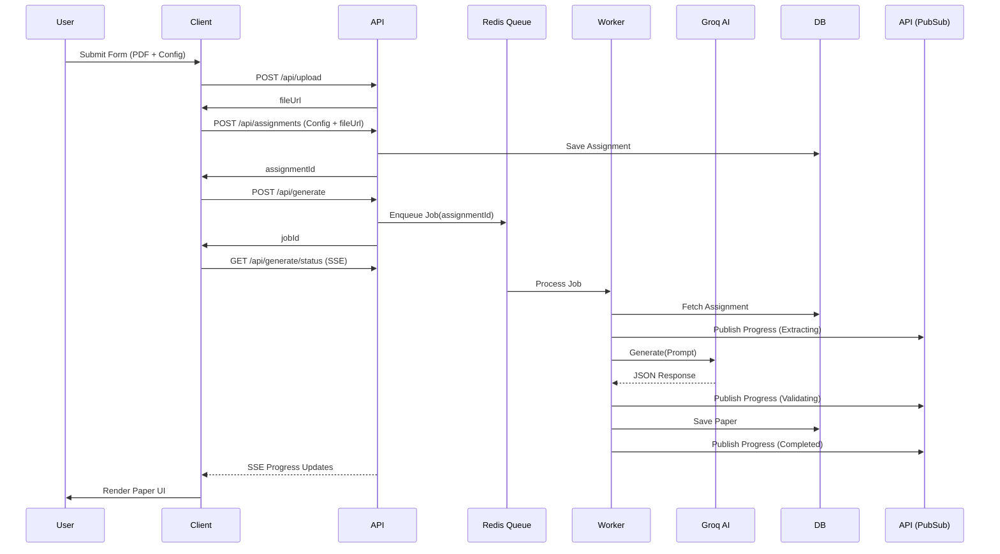

# Veda AI - System Architecture

This document provides a comprehensive overview of the architecture for the Veda AI application, an AI-powered assessment generation tool.

## High-Level Architecture

Veda AI follows a modern, scalable architecture designed for asynchronous processing and real-time updates.

```mermaid
graph TD
    Client[Next.js Client (React + Zustand)]
    API[Next.js API Routes]
    Worker[BullMQ Worker (Node.js)]
    DB[(MongoDB)]
    Redis[(Redis)]
    Groq[Groq AI API]

    Client -- HTTP GET/POST --> API
    Client -- Server-Sent Events (SSE) --> API
    
    API -- Reads/Writes --> DB
    API -- Enqueues Jobs / PubSub --> Redis
    
    Redis -- Dequeues Jobs --> Worker
    Worker -- LLM Prompts --> Groq
    Worker -- Publishes Progress --> Redis
    Worker -- Reads/Writes --> DB
```

## Core Components

### 1. Frontend Client
- **Framework**: Next.js 15 (App Router)
- **State Management**: Zustand (modular stores for `assignment.store` and `generation.store`).
- **Styling**: TailwindCSS with specialized CSS variables (`globals.css`) for a premium look.
- **UI Components**: Shadcn UI based (Radix primitives).
- **Forms**: React Hook Form with Zod validation schemas (extracted to `schemas/`).
- **Real-time**: Server-Sent Events (SSE) consumer for live generation progress.

### 2. API Layer (`app/api/`)
- RESTful endpoints handling CRUD operations for assignments and generated papers.
- Validates incoming requests using shared Zod schemas (`schemas/`).
- Handles file uploads by streaming them to the `LocalStorageProvider` (`features/storage/`).
- Enqueues generation jobs to BullMQ via Redis.
- SSE Endpoint (`/api/generate/status`) subscribes to Redis PubSub to stream updates back to the client.

### 3. Background Worker (`workers/`)
- A dedicated BullMQ worker (`generation.worker.ts`) decoupled from the API request-response cycle.
- Stages of execution:
  1. **Fetch**: Retrieves assignment details from MongoDB.
  2. **Extract**: Downloads file from storage and extracts text (e.g., via `pdf-parse`).
  3. **Prompt**: Dynamically builds an optimized prompt keeping token limits in check.
  4. **Generate**: Communicates with the AI provider (Groq) via a dependency-injected factory (`ai.factory.ts`).
  5. **Parse**: Validates the raw JSON response against strict Zod schemas (`AIResponseSchema`).
  6. **Save**: Stores the resulting `GeneratedPaper` in MongoDB.
- Emits progress updates at each stage to a Redis PubSub channel.

### 4. Storage Abstraction (`features/storage/`)
- `IStorageProvider` defines a common interface for file storage.
- Currently implemented using `LocalStorageProvider` (`uploads/` directory).
- Designed for easy drop-in replacement (e.g., AWS S3, Google Cloud Storage) as the app scales.

### 5. Data Persistence
- **MongoDB (Mongoose)**: Primary datastore for `Assignment`, `GeneratedPaper`, and `GenerationStatus`.
- **Redis**: Handles job queuing (BullMQ) and PubSub for real-time status updates across multiple API instances.

## Data Flow Diagram: Question Paper Generation



## AI Integration Pipeline
1. **Prompt Builder**: `buildQuestionPaperPrompt` truncates text based on token limits (approx 4 chars/token) to prevent max-context errors.
2. **Provider Abstraction**: `IAIProvider` interface allows switching models. The `GroqProvider` handles retries for transient errors and fallbacks to different models (e.g., if rate limited).
3. **Strict Validation**: The `ResponseParseError` class and Zod schemas (`schemas/paper.schema.ts`) ensure that if the AI hallucinates bad JSON, it is caught immediately before hitting the database. Recalculates totals securely.
